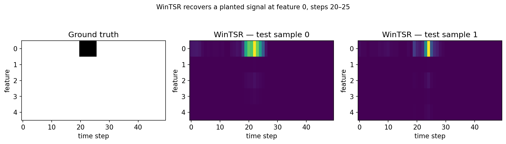

# tslens

### A consistent PyTorch interface to time-series attribution methods

**Discover which time steps and features drove your model's prediction.**

tslens is a Captum-compatible interpretability toolkit for PyTorch time-series
models. It bundles WinTSR — a local attribution method that accounts for
dependencies between neighbouring time steps and scores time and feature
importance jointly — alongside other established attribution methods behind
one consistent interface.

[Get started](#quickstart){ .md-button .md-button--primary }
[Open in Colab](https://colab.research.google.com/github/khairulislam/tslens/blob/main/notebooks/quickstart.ipynb){ .md-button }
[Read the paper](https://arxiv.org/abs/2412.04532){ .md-button }

<div class="tslens-stats" markdown>
  <div><strong>Captum + tint</strong><span>method coverage</span></div>
  <div><strong>TSlib</strong><span>architectures tested</span></div>
  <div><strong>Runnable</strong><span>notebooks</span></div>
  <div><strong>1</strong><span>consistent interface</span></div>
</div>



## What you get

<div class="grid cards" markdown>

-   :material-chart-timeline-variant-shimmer:{ .lg .middle } **Time-aware explanations**

    Preserve relationships between neighbouring observations instead of treating
    every input position independently.

-   :material-table-eye:{ .lg .middle } **Joint time–feature attribution**

    Locate the specific regions of an input window that mattered for a prediction.

-   :material-connection:{ .lg .middle } **Flexible model integration**

    Explain single- or multi-input PyTorch callables without adopting a training
    framework or dataset format.

-   :material-compare:{ .lg .middle } **A consistent comparison surface**

    Use WinTSR alongside established attribution methods from Captum and Time
    Interpret.

</div>

## A broad interpretation toolkit

Explore attribution methods spanning perturbation, gradient, learned-mask, and
surrogate approaches through a consistent PyTorch workflow. Choose an approach
based on your model, explanation goal, and available compute.

<div class="grid cards method-grid" markdown>

-   **Perturbation and occlusion**

    WinTSR · WinIT · Occlusion · Feature Ablation · Feature Permutation ·
    Augmented Occlusion · FIT

    [Explore perturbation methods →](methods.md#occlusion-based)

-   **Gradient-based**

    TSR · Integrated Gradients · Gradient SHAP

    [Explore gradient methods →](methods.md#gradient-based)

-   **Learned masks**

    GateMask · Dyna Mask · Extremal Mask

    [Explore learned masks →](methods.md#learned-masks)

-   **Local surrogate**

    Lime

    [Explore surrogate methods →](methods.md#surrogate)

</div>

[Compare all methods](methods.md){ .md-button .md-button--primary }
[Browse tested models](models.md){ .md-button }

## Quickstart

Install tslens from PyPI. Python 3.9+ and PyTorch 1.13+ are required.

```bash
pip install tslens
```

Pass a model and a tensor shaped `(batch, seq_len, n_features)`:

```python
import torch
from tslens import WinTSR

inputs = torch.randn(16, 96, 7)
baselines = torch.zeros_like(inputs)

attr = WinTSR(model).attribute(
    inputs,
    baselines=baselines,
    threshold=0.5,
)

attr.shape  # (16, n_output, 96, 7)
```

The result contains one `(seq_len, n_features)` saliency map for each model output.
Plot a map as a heatmap to inspect where the model found evidence.

!!! tip "Start with a faithful baseline"

    Zeros are appropriate for standardized inputs. If zero has a special meaning in
    your data, use [`get_baseline`](reference/functional.md) to generate a mean,
    normal, or random baseline.

## Key options

| Argument | Effect |
| --- | --- |
| `threshold` | Quantile of time relevance skipped during stage two. Higher values are faster and produce sparser maps; `0.0` keeps every step. |
| `sliding_window_shapes` | Attribution window over `(time, features)`. Increase the first value to attribute multi-step regions. |
| `baselines` | Values substituted for occluded regions. Defaults to zero. |
| `unflatten` | When `True` (default), returns `(batch, n_output, seq_len, n_features)`. |
| `legacy_normalize` | Constructor option that reproduces the normalization used for the published results. |

See the [WinTSR API reference](reference/wintsr.md) for every option.

## Multi-input models

Pass attributed tensors as a tuple and supply unchanged context through
`additional_forward_args`. For a TSlib model:

```python
attr_enc, attr_mark = WinTSR(model).attribute(
    inputs=(x_enc, x_mark_enc),
    baselines=(torch.zeros_like(x_enc), torch.zeros_like(x_mark_enc)),
    additional_forward_args=(x_dec, x_mark_dec),
)
```

The [integration cookbook](integration.md) covers TSlib, classification, custom model
outputs, single forecast horizons, baseline selection, and performance tuning.

## Explore the documentation

<div class="grid cards" markdown>

-   **[Integration cookbook](integration.md)**

    Copy-ready recipes for common model signatures and attribution workflows.

-   **[Interpretation methods](methods.md)**

    Compare requirements, trade-offs, and recommended use cases for every method.

-   **[Supported models](models.md)**

    Browse the architectures and calling conventions tested with WinTSR.

-   **[API reference](reference/wintsr.md)**

    Inspect signatures and parameters generated directly from the package docstrings.

</div>

## Reproduce the research

The separate [WinTSR-research](https://github.com/khairulislam/WinTSR-research)
repository contains the training harness, model zoo, datasets, experiment scripts,
and saved results used in the paper.

## Citation

If WinTSR supports your research, please cite:

```bibtex
@article{islam2024wintsr,
  title={WinTSR: A Windowed Temporal Saliency Rescaling Method for Interpreting Time Series Deep Learning Models},
  author={Islam, Md Khairul and Fox, Judy},
  journal={arXiv preprint arXiv:2412.04532},
  year={2024}
}
```
